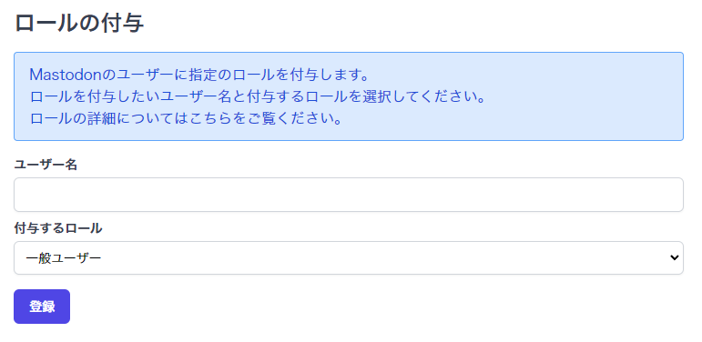

# ロールについて

Mastodonにはユーザーにロールを付与することができます。  
デフォルトで付与できるロールはOwner, Admin, Moderatorの3つがあります。  
ロールの詳細は以下の通りです。  

## Ownerで出来ること
管理者権限フラグが割り当てられ、すべての権限をバイパスするロールです。  
このロールを持つユーザは、すべての権限フラグが有効です。
また、ロールの権限を変更することが出来ます。  

## Adminで出来ること
以下の権限がデフォルトで付与されています。  

- **招待**
    - **ユーザーを招待**
        - 新しい人を招待できる
- **モデレーション**
    - **ダッシュボードの表示**
        - ダッシュボードやさまざまなメトリクスにアクセスできる
    - **監査ログの表示**
        - サーバー上で管理アクションの履歴を表示できる
    - **ユーザーの管理**
        - 他のユーザーの詳細情報を閲覧し、モデレーションを行うことができる
    - **アクセス権を管理**
        - 他のユーザーの2段階認証を無効にしたり、メールアドレスを変更したり、パスワードをリセットしたりすることができる
    - **ユーザーデータの削除**
        - ユーザーは、遅滞なく他のユーザーのデータを削除することができる
    - **レポートの管理**
        - ユーザーがレポートを確認したり、モデレーションアクションを実行したりできる
    - **抗議の管理**
        - モデレーションアクションに対する抗議を確認できる
    - **連合の管理**
        - ユーザーが他のドメインとの連合をブロックまたは許可したり、配信を制御したりできる
    - **ブロックの管理**
        - ユーザーがメールプロバイダとIPアドレスをブロックできる
    - **分類の管理**
        - トレンドコンテンツの確認とハッシュタグの設定の更新
    - **招待を管理**
        - 招待リンクの閲覧・解除を可能にする
- **管理**
    - **設定の管理**
        - サイト設定を変更できる
    - **ルールの管理**
        - サーバールールを変更できるようにします
    - **ロールの管理**
        - 自分より下の役割を管理し、割り当てることができる
    - **Webhookの管理**
        - 管理者イベントのWebhookを設定できる
    - **カスタム絵文字を管理**
        - ユーザーがサーバー上のカスタム絵文字を管理できる
    - **お知らせの管理**
        - ユーザーがアナウンスを管理できる

## Moderatorで出来ること
以下の権限がデフォルトで付与されています。  

- **モデレーション**
    - **ダッシュボードの表示**
        - ダッシュボードやさまざまなメトリクスにアクセスできる
    - **監査ログの表示**
        - サーバー上で管理アクションの履歴を表示できる
    - **ユーザーの管理**
        - 他のユーザーの詳細情報を閲覧し、モデレーションを行うことができる
    - **レポートの管理**
        - ユーザーがレポートを確認したり、モデレーションアクションを実行したりできる
    - **分類の管理**
        - トレンドコンテンツの確認とハッシュタグの設定の更新

## ロールの管理
ロールの管理方法は2通りあります。  
1. Mastodonの設定画面上で管理する  
2. Hostdonのコントロールパネルでロールの付与・変更を行う

### Mastodonの設定画面上で管理する
!!! Warning
    Mastodonの設定画面上ではOwnerロールを持ったユーザーのロール変更が出来ません。  
    Ownerユーザーのロールを変更したい場合はHostdonのコントロールパネル上で変更してください。

[https://サーバーのドメイン/admin/roles](https://サーバーのドメイン/admin/roles) にアクセスすると詳細な設定が可能です。

### Hostdonのコントロールパネルでロールの付与・変更を行う
[Hostdonコントロールパネル](https://manage.hostdon.jp) にログイン後、「Mastodonサーバー」→「管理」→「サーバーの選択」→「サーバー設定」→「ロールの付与」とアクセスすると以下の画面となります。
  
「ユーザー名」にロールを付与したいユーザー名を入力し、「付与するロール」から付与・変更したいロールを選択して登録ボタンを押すと、ロールの付与・変更が行われます。  